# (ant) — Brand manuál

> Kompletní podklad pro AI agenty.
> Generováno z Visualbooku dne 2026-05-25.
> Rozsah: Veřejný obsah.
> Jazyk: cs.

---

## Obsah

1. Logo
2. Barvy
3. Typografie
4. Šablony
5. Tone of Voice
6. Digitální nastavení
7. Externí odkaz
8. Obsahová stránka s přehledem všech sekcí
9. Brand Messaging
10. Vizuální identita
11. O značce
12. Design tokeny (design stránka)
13. Přiložené soubory

---

## 1. Logo

### Primární logo (ant)

- **Režim pozadí:** Světlé / Tmavé pozadí
- **Barvy pozadí:** světlé: `#ffffff`, tmavé: `#000000`

- Logo pro světlé pozadí (SVG): `assets/logos/logo-light-primarni-logo-ant.svg`
- Logo pro tmavé pozadí (SVG): `assets/logos/logo-dark-primarni-logo-ant.svg`

- **Minimální velikost:** na výšku — obrazovky: 14 px, tisk: 5 mm

- **Logo na barevném pozadí:**
Vzhledem ke specifickému odstínu zelené barvy (Pantone 3385 C) je logo v mintové barvě určeno primárně pro (web, sociální sítě, prezentace apod.). Barva není vhodná pro běžný tisk, protože v klasickém CMYK režimu ji nelze přesně reprodukovat. Pro tisk je potřeba použití speciální Pantone technologie, která nemusí být vždy dostupná. Kompletní logopack včetně transparentního loga a loga na plném pozadí ke stažení: ❯ Logopack (ant)
  - ✅ Povolené: `#5bffc4`, `#000000`, `#ffffff`, `#e7e8e9`, `#aeb1b7`
  - ❌ Zakázané: `#ffe4c1`, `#d7edff`, `#ffffff`

### Logo/Označení

- **Režim pozadí:** Světlé / Tmavé pozadí
- **Barvy pozadí:** světlé: `#ffffff`, tmavé: `#000000`

- Logo pro světlé pozadí (SVG): `assets/logos/logo-light-logo-s-claimem.svg`
- Logo pro tmavé pozadí (SVG): `assets/logos/logo-dark-logo-s-claimem.svg`

- **Minimální velikost:** na výšku — obrazovky: 16 px, tisk: 20 mm

- **Logo na barevném pozadí:**
Vzhledem ke specifickému odstínu zelené barvy (Pantone 3385 C) je logo v mintové barvě určeno primárně pro (web, sociální sítě, prezentace apod.). Barva není vhodná pro běžný tisk, protože v klasickém CMYK režimu ji nelze přesně reprodukovat. Pro tisk je potřeba použití speciální Pantone technologie, která nemusí být vždy dostupná. Kompletní logopack včetně transparentního loga a loga na plném pozadí ke stažení: ❯ Logopack (ant)
  - ✅ Povolené: `#5bffc4`, `#000000`, `#ffffff`, `#e7e8e9`


## 2. Barvy

#### Hlavní barvy

Tyto hlavní barvy vytvářejí základní vizuální charakter značky.

**Legenda tabulky:** Řádek = jedna barva. Sloupce HEX / RGB / CMYK / Pantone (C coated, U uncoated) / RAL / NCS popisují stejný odstín různými systémy.

| Název | HEX | RGB | CMYK | Pantone C | Pantone U | RAL | NCS |
| --- | --- | --- | --- | --- | --- | --- | --- |
| Zelená | #5bffc4 | 91, 255, 196 | - | Pantone 3385 | — | - | — |
| Černá | #000000 | 0, 0, 0 | 60-40-40-100 | Pantone Black C | Pantone Black U | 9005 | — |
| Šedá Světlá | #e7e8e9 | 231, 232, 233 | 2-1-1-8 | Pantone 427 C | — | 9003 | — |
| Šedá Tmavá | #aeb1b7 | 174, 177, 183 | - | — | — | - | — |

#### Sekundární barvy

Barvy používané v prostředí aplikace (UI - User Interface) a na webu.

**Legenda tabulky:** Řádek = jedna barva. Sloupce HEX / RGB / CMYK / Pantone (C coated, U uncoated) / RAL / NCS popisují stejný odstín různými systémy.

| Název | HEX | RGB | CMYK | Pantone C | Pantone U | RAL | NCS |
| --- | --- | --- | --- | --- | --- | --- | --- |
| Hnědá Světlá | #ffe4c1 | 255, 228, 193 | — | — | — | — | — |
| Fialová Světlá | #dad4ff | 218, 212, 255 | — | — | — | — | — |
| Hnědá Tmavá | #f4ca99 | 244, 202, 153 | — | — | — | — | — |
| Žlutá | #fffd92 | 255, 253, 146 | — | — | — | — | — |
| Růžová | #ffe2eb | 255, 226, 235 | — | — | — | — | — |
| Modrá SVětlá | #d7edff | 215, 237, 255 | — | — | — | — | — |

#### Palety barev

Barevné palety nám umožňují vytvářet digitální prostředí (aplikace, web) s ohledem na dostatečný kontrast a přístupnost všech prvků.

##### Gray
**Legenda tabulky:** Stejný význam sloupců jako u přehledu barev (HEX, RGB, CMYK, Pantone, RAL, NCS); sloupec 3M = specifická reference, pokud je vyplněna.

| Název | HEX | RGB | CMYK | Pantone C | Pantone U | RAL | NCS | 3M |
| --- | --- | --- | --- | --- | --- | --- | --- | --- |
| Gray 100 | #161616 | 22, 22, 22 | — | — | — | — | — | — |
| Gray 90 | #262626 | 38, 38, 38 | — | — | — | — | — | — |
| Gray 80 | #393939 | 57, 57, 57 | — | — | — | — | — | — |
| Gray 70 | #525252 | 82, 82, 82 | — | — | — | — | — | — |
| Gray 60 | #6F6F6F | 111, 111, 111 | — | — | — | — | — | — |
| Gray 50 | #8D8D8D | 141, 141, 141 | — | — | — | — | — | — |
| Gray 40 | #A8A8A8 | 168, 168, 168 | — | — | — | — | — | — |
| Gray 30 | #C6C6C6 | 198, 198, 198 | — | — | — | — | — | — |
| Gray 20 | #E0E0E0 | 224, 224, 224 | — | — | — | — | — | — |
| Gray 10 | #F4F4F4 | 244, 244, 244 | — | — | — | — | — | — |
| Gray 00 | #FAFAFA | 250, 250, 250 | — | — | — | — | — | — |

##### Cool Gray
**Legenda tabulky:** Stejný význam sloupců jako u přehledu barev (HEX, RGB, CMYK, Pantone, RAL, NCS); sloupec 3M = specifická reference, pokud je vyplněna.

| Název | HEX | RGB | CMYK | Pantone C | Pantone U | RAL | NCS | 3M |
| --- | --- | --- | --- | --- | --- | --- | --- | --- |
| Cool Gray 100 | #121619 | 18, 22, 25 | — | — | — | — | — | — |
| Cool Gray 90 | #21272A | 33, 39, 42 | — | — | — | — | — | — |
| Cool Gray 80 | #343A3F | 52, 58, 63 | — | — | — | — | — | — |
| Cool Gray 70 | #4D5358 | 77, 83, 88 | — | — | — | — | — | — |
| Cool Gray 60 | #697077 | 105, 112, 119 | — | — | — | — | — | — |
| Cool Gray 50 | #878D96 | 135, 141, 150 | — | — | — | — | — | — |
| Cool Gray 40 | #A2A9B0 | 162, 169, 176 | — | — | — | — | — | — |
| Cool Gray 30 | #C1C7CD | 193, 199, 205 | — | — | — | — | — | — |
| Cool Gray 20 | #DDE1E6 | 221, 225, 230 | — | — | — | — | — | — |
| Cool Gray 10 | #F2F4F8 | 242, 244, 248 | — | — | — | — | — | — |
| Cool Gray 00 | #fafafa | 250, 250, 250 | — | — | — | — | — | — |

##### Mint Green
**Legenda tabulky:** Stejný význam sloupců jako u přehledu barev (HEX, RGB, CMYK, Pantone, RAL, NCS); sloupec 3M = specifická reference, pokud je vyplněna.

| Název | HEX | RGB | CMYK | Pantone C | Pantone U | RAL | NCS | 3M |
| --- | --- | --- | --- | --- | --- | --- | --- | --- |
| Mint Green 100 | #d3fff5 | 211, 255, 245 | — | — | — | — | — | — |


## 3. Typografie

#### Aktiv Grotesk EX

Hlavní písmo používáme primárně pro nadpisy. Je důležitým prvkem vizuální identity a slouží jako jeden z primárních signifikantů značky.

- **Získat písmo:** https://fonts.adobe.com/fonts/aktiv-grotesk-extended

**Používané řezy písma:** Regular (400), Medium (500), SemiBold (600), Bold (700)

#### Inter

Doplňkové písmo Inter používáme v běžném odstavcovém textu v řezech Light/Regular/Bold. Písmo Inter je součástí Google Fonts.

- **Stáhnout písmo:** `assets/fonts/inter_font.zip`

**Používané řezy písma:** Regular (400), Light (300), Medium (500), SemiBold (600), Bold (700)

#### Alternativní písmo

Alternativní písmo je univerzální a dostupné na všech počítačích. Text napsaný tímto písmem se s vysokou pravděpodobností zobrazí správně i příjemcům.

- **PC (Windows):** Arial
- **Mac:** Helvetica / Sans Francisco

#### Používání písem

Tabulka pro orientaci, kdy je vhodné použít hlavní, doplňkové nebo alternativní písmo. Uvedená pravidla vycházejí především z licenčních možností daných písem.

- **Aktiv Grotesk EX:** Webdesign, Mobilní aplikace, Sdílené online dokumenty, Offline dokumenty, Marketingové tiskoviny
- **Inter:** Webdesign, Offline dokumenty, Sdílené online dokumenty, Mobilní aplikace, Marketingové tiskoviny


## 4. Šablony

#### Dokumenty a prezentace

**Položky (kam karty vedou):**

- **Firemní dokument:** https://docs.google.com/document/d/19dH8iwId2A08xiHDyQ9enX_IanRKMkMxphHIePMA0W8/edit?usp=sharing — Základní šablona pro oficiální komunikaci v rámci firmy – dopisy, zápisy, potvrzení apod.
- **Google prezentace:** https://docs.google.com/presentation/d/1ctNQpx6VzCHSKbvLPgGgJRA6M5TxgOoyXOHGhz1E5r0/edit?usp=sharing — Prezentace společnosti ve formátu Google Slides. Určeno pro obchodní schůzky nebo veřejná vystoupení.
- **Obecný dokument:** https://docs.google.com/document/d/17GU8NQ3ubVsNad-7xlgOB6wQ2_QmK2Tk2PkwRidlghU/edit?usp=sharing — Univerzální Google Docs šablona pro neformální či interní zápisy a poznámky.
- **NDA Smlouva:** https://docs.google.com/document/d/1_-SlyxnFwtGzyhO3fvQY2gixLZqVf8oYaMUpZkTwhBI/edit?usp=sharing — Předpřipravená šablona dohody o mlčenlivosti pro partnery a klienty.
- **Technická specifikace k nabídce:** https://docs.google.com/document/d/1e9EQ0oDOvVgnlGABDa2QqraZUPGP5iwSmxwm6DEewyo/edit?usp=sharing — Dokumentace s technickými parametry a specifikacemi navrženého řešení k nabídkám.
- **Klientský report:** https://www.figma.com/proto/uj3cFH1orOYFBrYPUpSwH1/-ant--brand-2025-GUIDE?page-id=79%3A22&node-id=100-23&p=f&viewport=25%2C275%2C0.33&t=fKRFCSG2wYXz8soS-1&scaling=min-zoom&content-scaling=fixed — Report aktualizací a stavu webu.
- **Objednávka služeb:** https://docs.google.com/document/d/1cvjfPbvGaG_a_LIubx2CplU5jaDi1nda3x7oShLSJkQ/edit?usp=sharing — Podmínky, objednávka
- **Podmínky spolupráce:** https://docs.google.com/document/d/1N7YnA4lTSX9EHRQmrsm87sMSWRgopjMvwenAnSdr5bA/edit?usp=sharing — Podrobné informace ke spolupráci s (ant)
- **Rámcová smlouva:** https://docs.google.com/document/d/13X0eI_JglYLhkhv1Gzm9qZRfj9LMosId5R0O5UPATxQ/edit?usp=sharing — Smlouva ke spolupráci
- **SLA Smlouva:** https://docs.google.com/document/d/1Pe27E-uDHIDc2dKh334u6f88LYwiII2o5n8A6kqpi40/edit?usp=sharing — Smlouva o poskytování služeb servisu, podpory a rozvoje (SLA)

#### Tiskoviny

**Položky (kam karty vedou):**

- **Pravidla správného (antáka):** https://drive.google.com/drive/folders/1i2TgnkKIbLaBZtLJUWkrtyU_faghRJs9?usp=share_link
  - **Obrázek na kartě:** 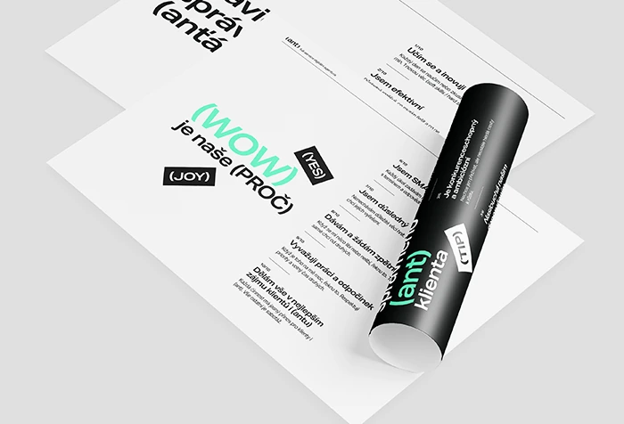

- **Obrazy - 4 dohody:** https://drive.google.com/drive/folders/1tyduI6A6JUC9ulGu1ULSnZpOXOCP77R7?usp=sharing
  - **Obrázek na kartě:** 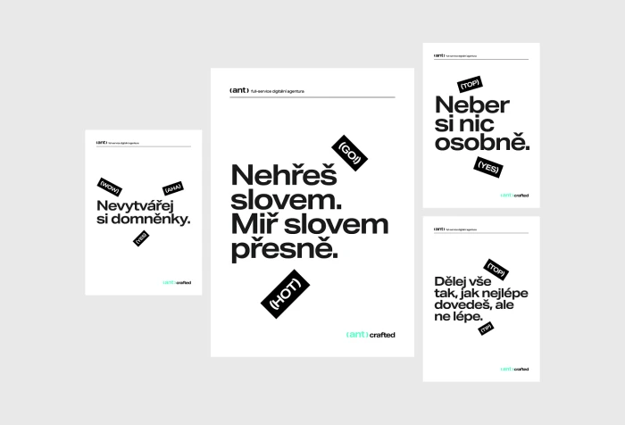

- **RollUP:** https://drive.google.com/drive/folders/1-_sEW8yHBxx-5rXLGMvteXs77kWLFUaI?usp=share_link
  - **Obrázek na kartě:** 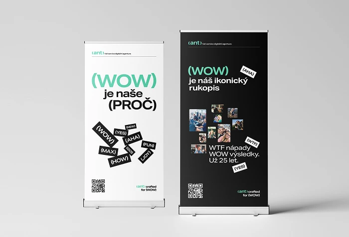

#### Budete potřebovat ...

**Položky (kam karty vedou):**

- **Logo:** https://brand.antstudio.cz/logo — Stáhněte si logo ve správné variantě pro vaše použití. Udržujte vizuální konzistenci a sílu značky.
- **Typografie:** https://brand.antstudio.cz/pisma — Písmo tvoří charakter značky. Nainstalujte schválené fonty pro jednotný vizuální styl.
- **Barvy:** https://brand.antstudio.cz/barevnost — Definované barevné kódy pro digitální i tiskové aplikace. Používejte je konzistentně napříč všemi materiály.


## 5. Tone of Voice


## 6. Digitální nastavení

#### Labels

Tento grafický element tvoří hravou a dynamickou součást vizuálního stylu značky. Slouží k upoutání pozornosti, zvýraznění klíčových sdělení nebo zdůraznění emocí jak v online, tak offline materiálech. Je navržen pro snadné použití a přizpůsobení napříč různými barevnými schématy (dle barevné palety brandu). Inspirujte se ukázkovým použitím níže a využijte jejich potenciál k vizuálnímu zpestření komunikace. Chceš přidat nový label? napiš na ondrej.folbr@antstudio.cz

---

**Obrázek v sekci** (1/4)

**Obrázek:** 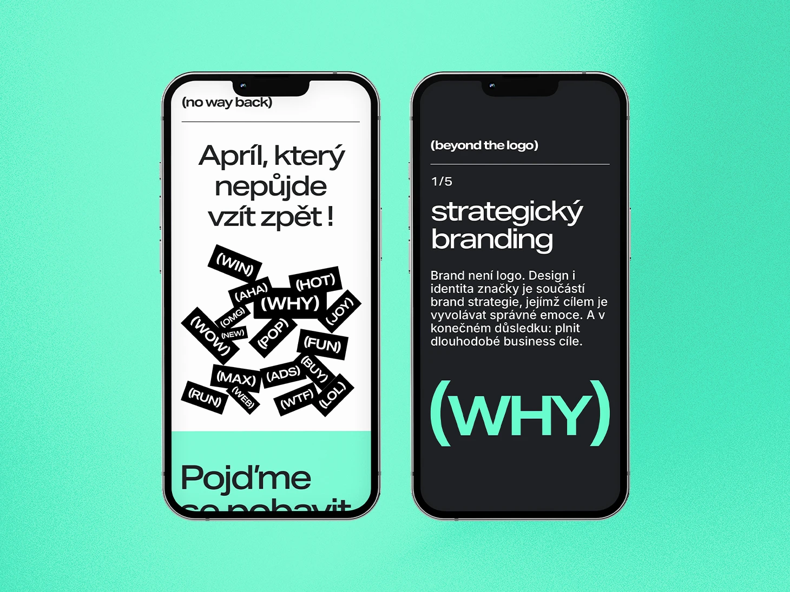

---

**Obrázek v sekci** (2/4)

**Obrázek:** 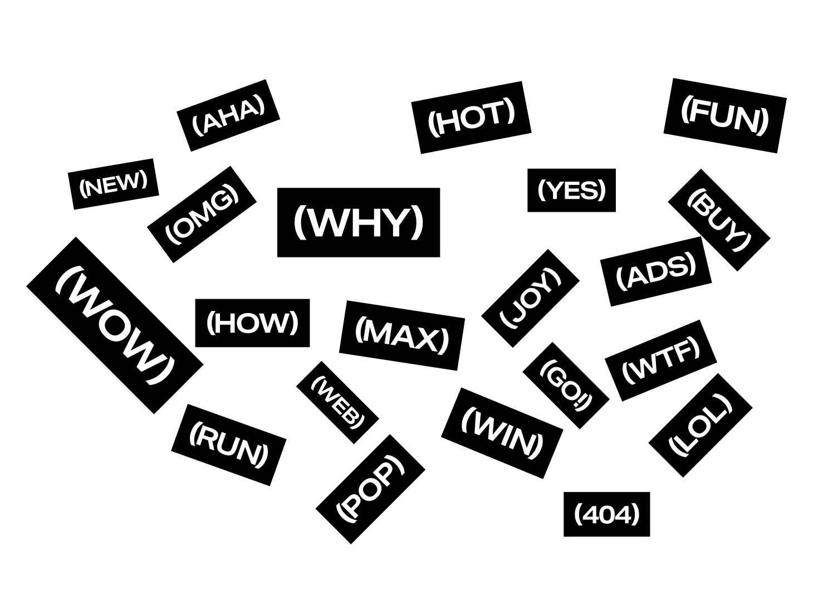

---

**Obrázek v sekci** (3/4)

**Obrázek:** 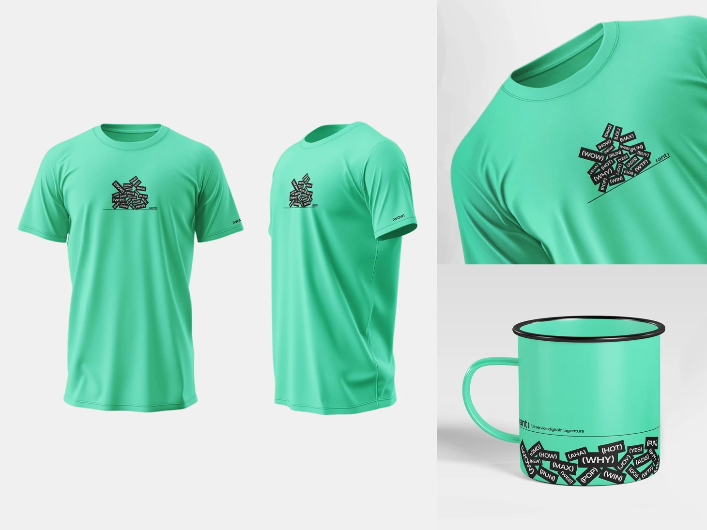

---

**Obrázek v sekci** (4/4)

**Obrázek:** 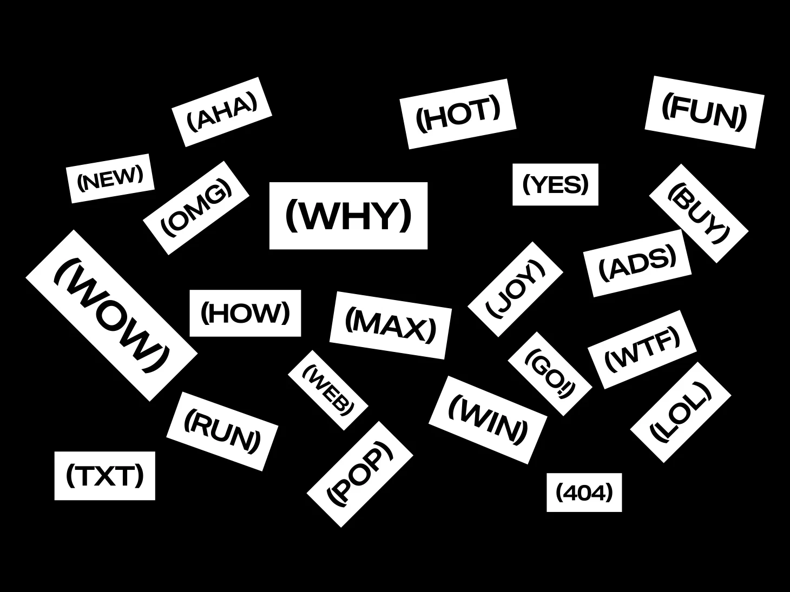

---

**Tlačítka pod obrázkem:**

- **Google Drive - SVG/PNG:** https://drive.google.com/drive/folders/1qWOzzdp0dCLKKvcJBRCg7IHz7sa6GnoZ?usp=share_link
- **Figma:** https://www.figma.com/design/7qharWUi5ioKa4aWpw6wng/Labels?node-id=1-2&t=c8HhL7owtNqdnq4W-1

#### Autorský podpis

(ant) crafted“ funguje jako náš autorský podpis. Ukazuje, že daný výstup (web, prezentace, kampaň…) byl „vyroben“ (crafted) agenturou (ant). Primární (ant) crafted – naše čistá signatura 👉 footer každého webu Rozšířená (ant) crafted for (WOW) – když chceme zdůraznit TOP projekt 👉 footer TOP webu/eshop 👉 social posty Dynamická přidat jméno tvůrce, verzi, město, typ výstupu (“brands”, “campaigns”, “strategies”) atp., podle kontextu projektu. Používáme interně. 👉 koncepty a prezentace in/out Chceš dynamickou variantu? napiš na ondrej.folbr@antstudio.cz

---

**Obrázek v sekci** (1/3)

**Obrázek:** 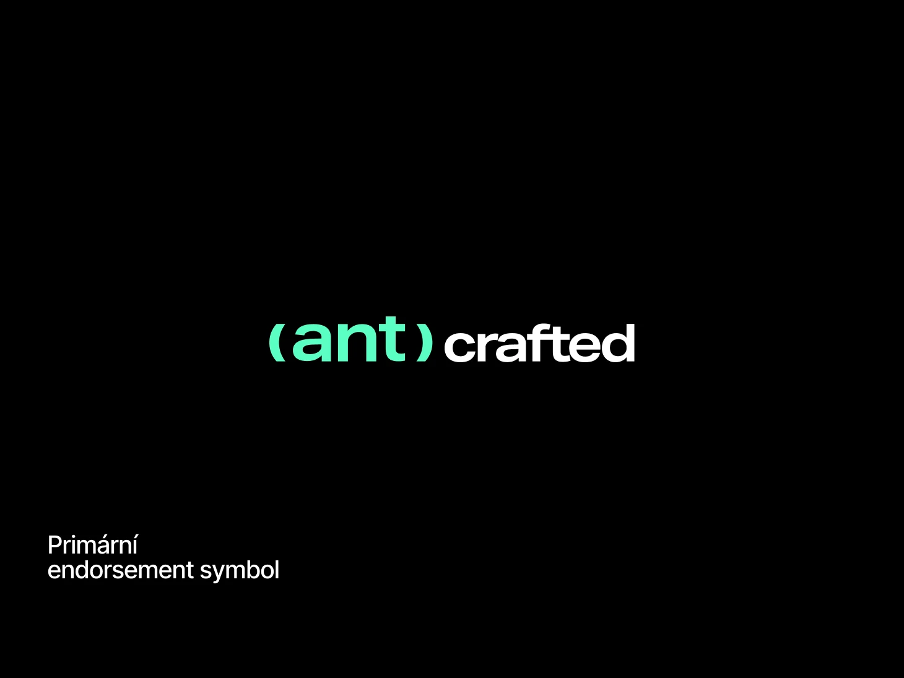

---

**Obrázek v sekci** (2/3)

**Obrázek:** 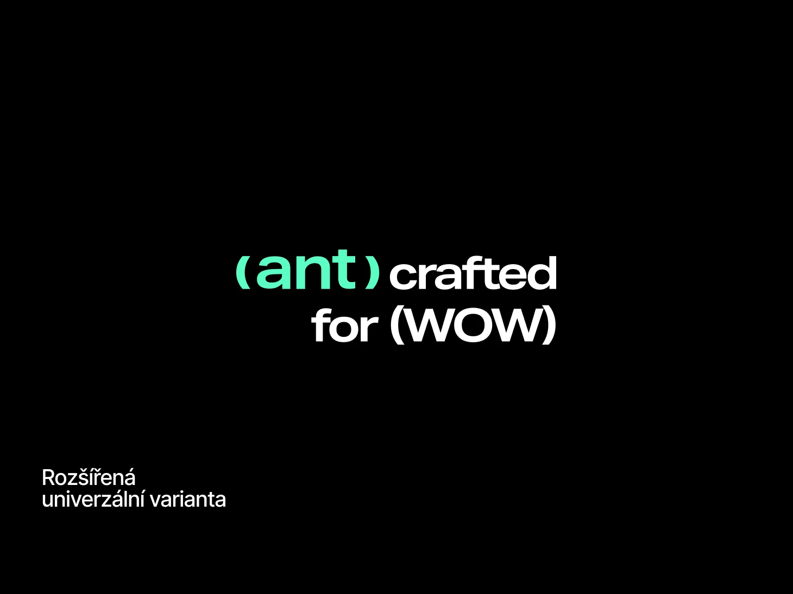

---

**Obrázek v sekci** (3/3)

**Obrázek:** 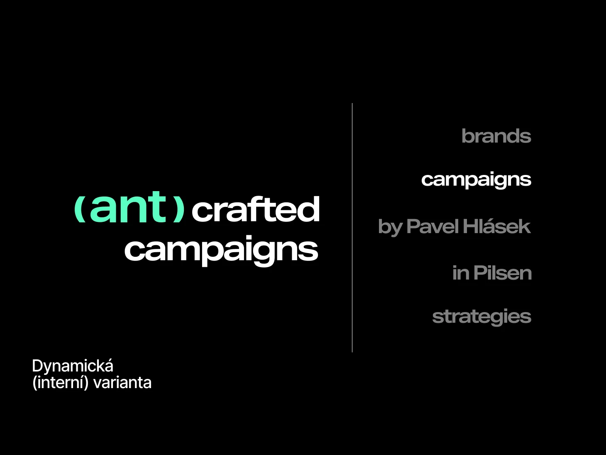

---

**Tlačítka pod obrázkem:**

- **Ke stažení pro obrazovky - SVG/PNG:** https://drive.google.com/drive/folders/1gYzLu8NTBk0uTcjnZwsSrPszJhXgiD0Y?usp=share_link

#### Google Meet

Pro online schůzky jsme připravili sadu brandových pozadí, která vycházejí z vizuální identity značky. Tyto pozadí pomáhají sjednotit naši prezentaci, podpořit zapamatovatelnost a zároveň vnést do digitální komunikace hravý vizuální prvek. Používejte je při interních i externích meetech a vyberte si variantu, která nejlépe odpovídá situaci a vašemu stylu.

---

**Obrázek v sekci** (1/7)

**Obrázek:** 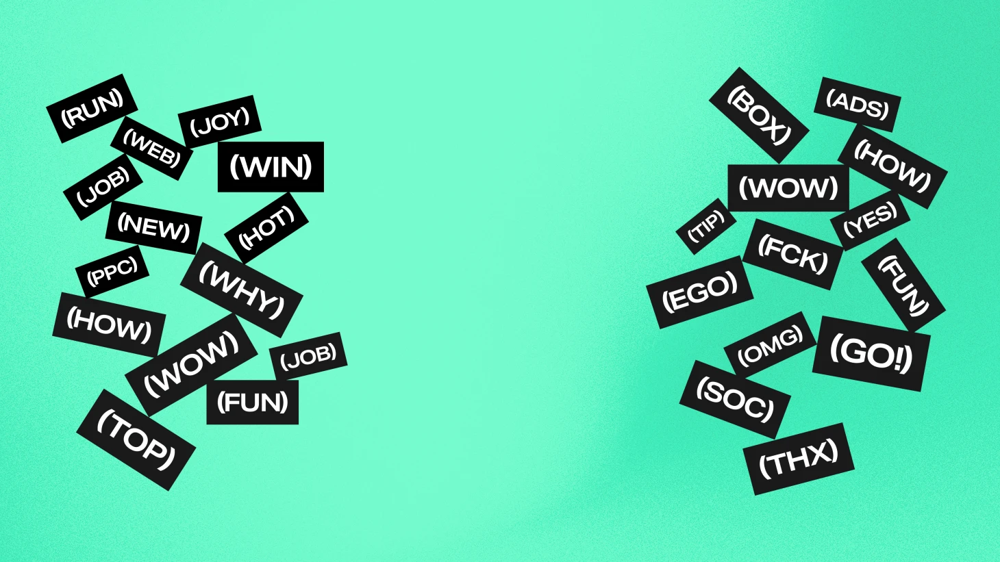

---

**Obrázek v sekci** (2/7)

**Obrázek:** 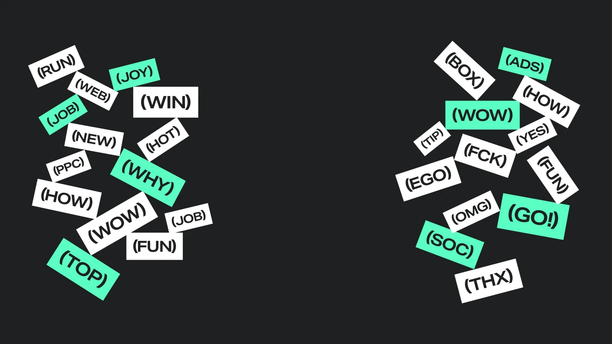

---

**Obrázek v sekci** (3/7)

**Obrázek:** 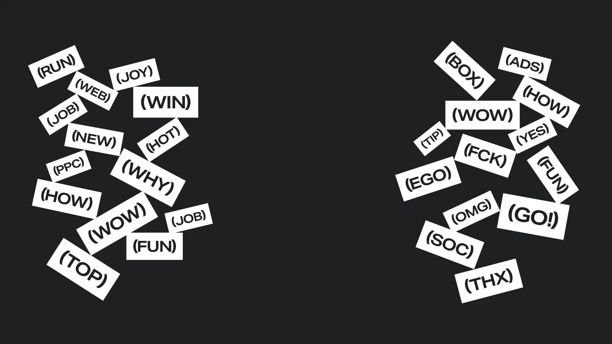

---

**Obrázek v sekci** (4/7)

**Obrázek:** 

---

**Obrázek v sekci** (5/7)

**Obrázek:** 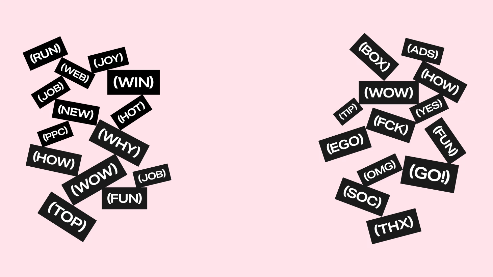

---

**Obrázek v sekci** (6/7)

**Obrázek:** 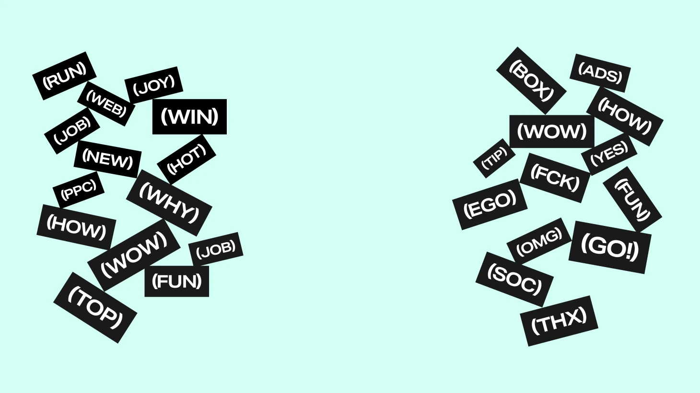

---

**Obrázek v sekci** (7/7)

**Obrázek:** 

---

**Tlačítka pod obrázkem:**

- **Google meet pozadí - GOOGLE DRIVE:** https://drive.google.com/drive/folders/11Powaka8_tCH6pVAEtNRnM5o2WGOPcu0?usp=share_link

#### AI Notetaker

Profilovka pro našeho AI Notetakera (tl;dv). Používejte ji v týmu pro sjednocení vizuální identity. 👉 určeno pro interní použití 👉 ideální pro tl;dv / meeting bots

**Poznámka:** Náš AI Notetaker (tl;dv) funguje jako rozšíření našeho workflow. Automaticky zaznamenává meetingy, pořizuje přepisy, sumarizuje klíčové body a předává je týmu v podobě srozumitelných výstupů.

**Obrázek:** 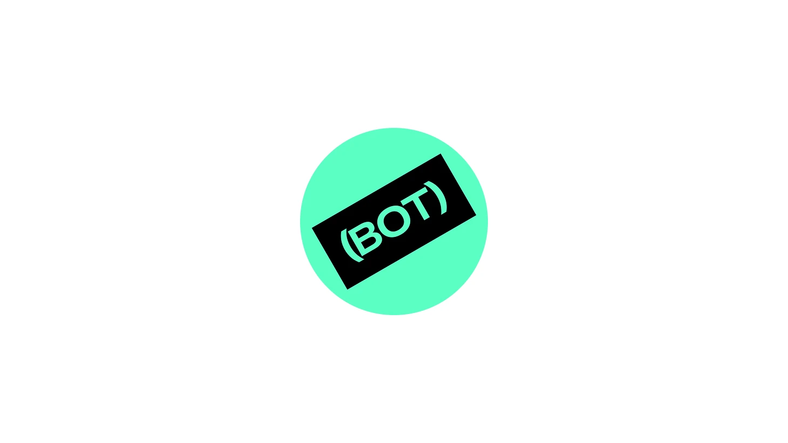

---

**Tlačítka pod obrázkem:**

- **Profil tl;dv - AI Notetaker:** `assets/others/bot_ant_profil.png`

#### E-mailový podpis

Nástroj pro sjednocení naší komunikace. Každý mail je brand dotek. Podpis není vizitka, je to součást našeho systému. 👉 určeno pro interní tým (ant) 👉 generuje validní HTML kód

**Tip:** Náš generátor na podpis.antstudio.app zajišťuje, že každý výstup z mraveniště vypadá (WOW). Žádné rozbité fonty. Žádné obří přílohy. Jen čisté řemeslo, které prodává naši profesionalitu při každém odeslání.

**Obrázek:** 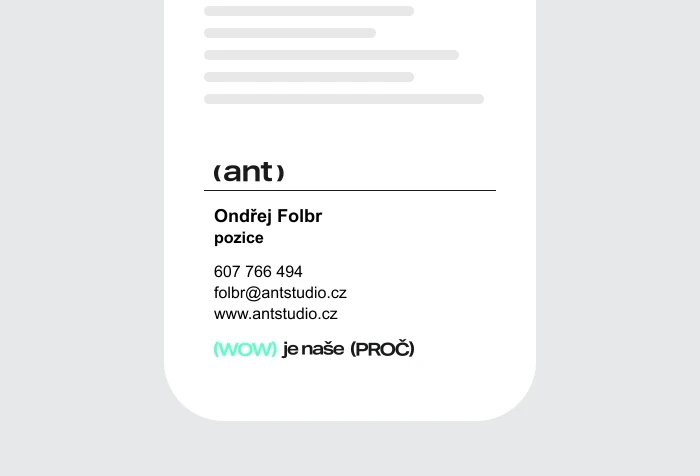
**Text pod obrázkem:** *(bez textu pod obrázkem)*


## 7. Externí odkaz

Směřujte uživatele tam, kam potřebujete. Externí odkazy propojí váš brand s důležitými místy mimo tento prostor.

**Odkaz:** https://visualbook.pro


## 8. Obsahová stránka s přehledem všech sekcí

#### Sekce: Obrázek (multifunkční)

Na rozdíl od sekce Obrázek tato sekce k obrázku integruje tlačítka nebo rozbalovací pole pro definování různých pravidel. Tato je sekce je jednoznačně nejpoužívanější sekcí při tvorbě vizuálních pravidel. Nabízí možnosti definování grafiky společně s tlačítky ke stažení zdrojových souborů nebo podrobné návody s cover obrázkem. Ukázky, jak můžete tuto sekci používat, uvádíme níže. brand.antstudio.cz/obsahova-stranka-s-prehledem-vsech-sekci/modules/sekce-obrazek-jednoduchy TIP: Věděli jste, že obsah výše je generován automaticky? Stačí v nastavení Obsahové stránky zaškrtnou tlačítko „Generovat obsah stránky“ a vloží se automaticky.

**Obrázek:** 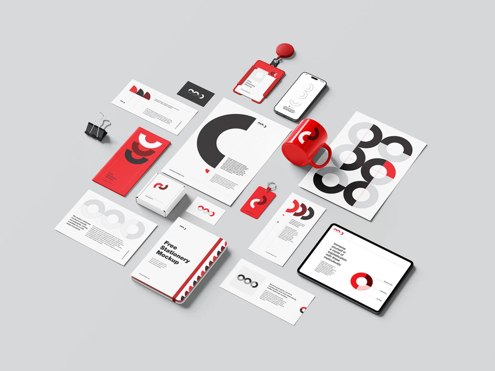

---

**Tlačítka pod obrázkem:**

- **Získat mockup:** https://mockups-design.com/
- **Stáhnout náhled:** `assets/images/stationery_mockup_1.webp`

##### Rozbalovací obsah

V tomto rozbalovacím obsahu můžete sepsat další pravidla ve vašem brand manuálu. Množství informací a rozbalovacích obsahů je jen na vás.

---

##### Další rozbalovací obsah

V tomto rozbalovacím obsahu můžete sepsat další pravidla ve vašem brand manuálu. Množství informací a rozbalovacích obsahů je jen na vás.

#### Sekce: Obrázek (jednoduchý)

Obrázek (jednoduchý) je sekce s obrázkem a případně i volitelným textem pod ním. Umožňuje kamkoliv do obsahové stránky vložit obrázek nebo fotografii a definovat jeho pravidla používání. TIP: Jednoduchý obrázek můžete také zobrazit v lightboxu ve větším rozlišení, jakmile na něj kliknete.

**Obrázek:** 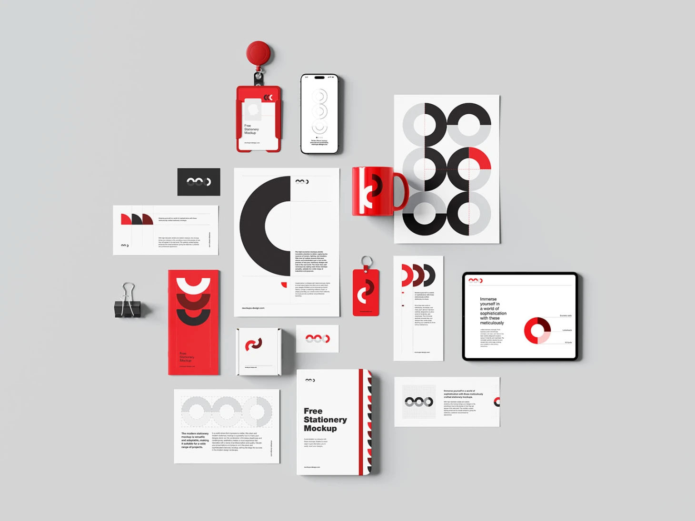
**Text pod obrázkem:** Pod obrázek můžete vložit textové pole, kde můžete popsat případná pravidla zobrazená na obrázku. Samozřejmostí jsou externí odkazy nebo zvýraznění textu. Můžete vložit také číslované nebo nečíslované seznamy: Položka 1 Položka 2 Položka 3 Položka 4

#### Sekce: Galerie obrázků

Sekce Galerie je jedna s nejpřínosnějších sekcí pro grafické manuály a brand booky. Můžete pomocí těchto sekcí tvořit nejen galerie obrázků do různých skupin, ale také přidávat pravidla Povoleno nebo Zakázáno a tím vizuálně definovat, jak pracujete například s fotografiemi, nebo jiným vizuálním obsahem. **Každá sekce může mít nastaveny tyto individuální poměry stran obrázků: Originální 16:9 4:3 1:1**

**Legenda pravidel** (stav použití položky v galerii):

- **zakázáno** — nevhodný příklad (na webu se zobrazí přeškrtnutí).
- **povoleno** — správný příklad (na webu ikona ✓).
- **bez pravidel** — neutrální zobrazení, bez přeškrtnutí ani ✓.

---

**Položka galerie** (1/4)

**Obrázek:** 
**Popisek tohoto obrázku:** Každou fotografii můžete okomentovat pomocí tohoto popisku
**Pravidlo:** zakázáno

---

**Položka galerie** (2/4)

**Obrázek:** 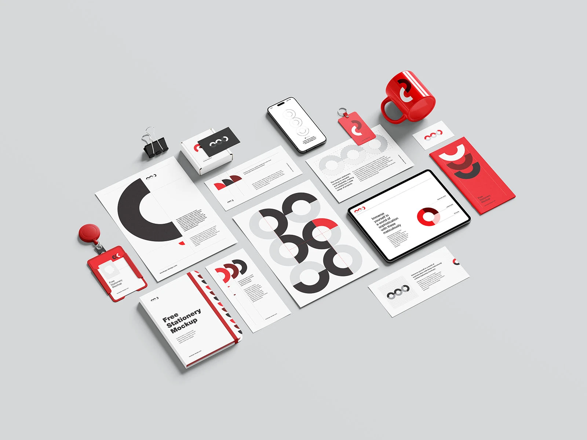
**Popisek tohoto obrázku:** Každou fotografii můžete okomentovat pomocí tohoto popisku
**Pravidlo:** povoleno

---

**Položka galerie** (3/4)

**Obrázek:** 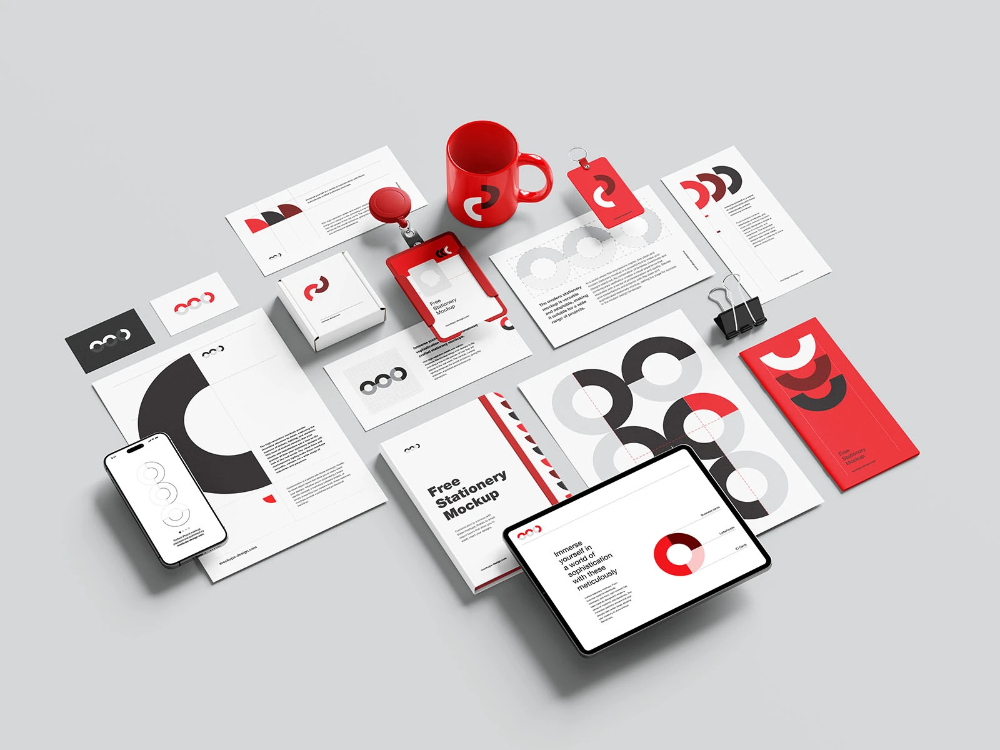
**Popisek tohoto obrázku:** Fotografie může být také bez pravidel (přeškrtnutí nebo s ikonou „check“).
**Pravidlo:** bez pravidel

---

**Položka galerie** (4/4)

**Obrázek:** 
**Popisek tohoto obrázku:** *(bez textového popisku)*
**Pravidlo:** bez pravidel

**Text pod galerií:**

<p>Pod galerii můžete vložit textové pole, kde můžete popsat případná pravidla zobrazená v galerii. Samozřejmostí jsou externí odkazy nebo zvýraznění textu. Můžete vložit také číslované nebo nečíslované seznamy:</p>
<ul>
<li>Položka 1</li>
<li>Položka 2</li>
<li>Položka 3</li>
<li>Položka 4</li>
</ul>

#### Sekce: Karusel (slideshow)

Karusel je sekce, která postupně zobrazuje obrázky v podobě automatické slideshow. To znamená, že návštěvník po načtení stránky vidí první obrázek, po chvíli se mu vymění za druhý, pak za další atd.

---

**Obrázek v karuselu:** (1/5) 

---

**Obrázek v karuselu:** (2/5) 

---

**Obrázek v karuselu:** (3/5) 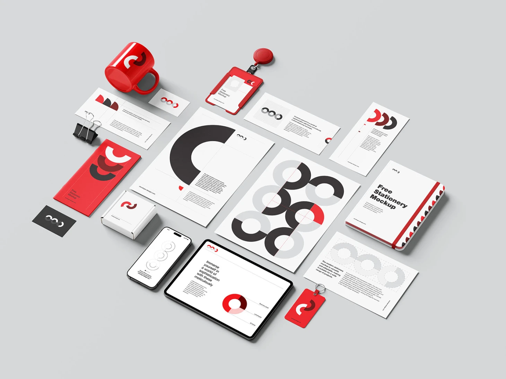

---

**Obrázek v karuselu:** (4/5) 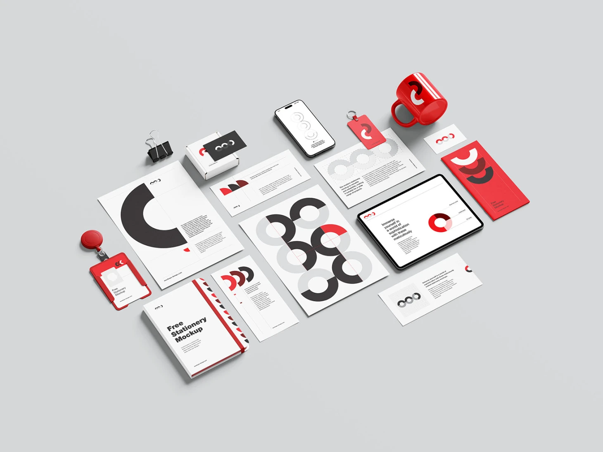

---

**Obrázek v karuselu:** (5/5) 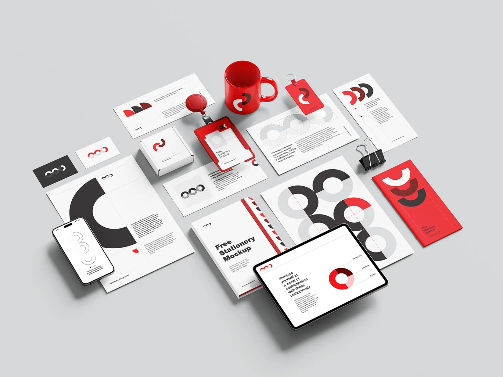

#### Sekce: Text

Sekce text umožňuje předávat informace a pravidla prostřednictvím textů ve formě odstavců s několika možnostmi formátování. Můžete do textu vkládat externí odkazy, zvýraznění a další možnosti, které jsou vypsány níže. TIP: Sekce můžete vkládat libovolně do jakékoliv obsahové stránky nebo také do výchozích stránek, jako jsou Loga, Písma a Barvy.

### Velký nadpis

<p>Lorem ipsum dolor sit amet, consectetuer adipiscing elit. Maecenas fermentum, sem in pharetra pellentesque, velit turpis volutpat ante, in pharetra metus odio a lectus. Temporibus autem quibusdam et aut officiis debitis aut rerum necessitatibus saepe eveniet ut et <a href="https://visualbook.pro/">voluptates repudiandae</a> sint et molestiae non recusandae. Vestibulum erat nulla, ullamcorper nec, rutrum non, nonummy ac, erat. Aliquam erat volutpat. Class aptent <strong>taciti sociosqu</strong> ad litora torquent per conubia nostra, per inceptos hymenaeos. Nunc tincidunt ante vitae massa. Aliquam in lorem sit amet leo accumsan lacinia. Nullam rhoncus aliquam metus. Phasellus faucibus molestie nisl. Morbi imperdiet, mauris ac auctor dictum, nisl ligula egestas nulla, et sollicitudin sem purus in lacus.</p>

#### Malý napis

- Slot číslo 1
- Slot číslo 2
- Slot číslo 3

<p>Integer rutrum, orci vestibulum ullamcorper ultricies, lacus quam ultricies odio, vitae placerat pede sem sit amet enim. Nemo enim ipsam voluptatem quia voluptas sit aspernatur aut odit aut fugit, sed quia consequuntur magni dolores eos qui ratione voluptatem sequi nesciunt.</p>

#### Sekce: Psaní názvů a textů

Tato sekce definuje dva typy pravidel: Psaní názvů: zaměřuje na názvy, slogany a krátká textová pravidla. Psaní textů: zaměřuje na delší textová pravidla, kde je možné opět vkládat různá formátování textu a více detailněji tak popsat daná pravidla.

**Popisek pod nadpisem této sekce:**

Tato sekce definuje dva typy pravidel:
Psaní názvů: zaměřuje na názvy, slogany a krátká textová pravidla.
Psaní textů: zaměřuje na delší textová pravidla, kde je možné opět vkládat různá formátování textu a více detailněji tak popsat daná pravidla.

**✅ Správný zápis názvu:**

Visualbook

**❌ Nesprávný zápis názvu:**

visualbook
VISUALBOOK
VisualBook
Visual Book

#### Sekce: Audio

Sekce audio vám umožňuje sdílet zvukové stopy, kterými můžete definovat různá pravidla. Například můžete definovat výslovnost názvu vaší značky nebo produktu. Dále můžete sekci Audio využít pro definování audio brandingu.

**Legenda:** Každý blok = jedna audio stopa (nadpis z panelu). Popis a cesta k souboru odpovídají polím v sekci Audio.

##### Znělka pro animaci loga

**Popis:**

Volitelný popisek

- **Audio soubor:** *(chráněno heslem nebo bez povoleného stažení — v archivu není; použijte živý manuál)*

##### Znělka podcastu

- **Audio soubor:** *(chráněno heslem nebo bez povoleného stažení — v archivu není; použijte živý manuál)*

##### Znělka YouTube reklamy

- **Audio soubor:** *(chráněno heslem nebo bez povoleného stažení — v archivu není; použijte živý manuál)*

#### Sekce: Video

Sekce video umožňuje velmi variabilně vkládat vlastní videa nebo videa z YouTube. Můžete nastavit několik možností zobrazení, autoplay nebo popisky pod jednotlivá videa.

**Náhledy videí a animací:** malé

##### Video 1

**Odkaz na YouTube video:** https://youtu.be/eKrrIGmbdBg

**Text pod videem:** Práce se soubory ve Visualbooku

##### Video 2

**Odkaz na YouTube video:** https://youtu.be/G6ML23mnJI4

**Text pod videem:** Jak nastavit vlastní styl Visualbooku

##### Video 3

**Odkaz na YouTube video:** https://youtu.be/fBTdS41stWg

**Text pod videem:** Představení admin panelu Visualbooku

##### Video 4

**Odkaz na YouTube video:** https://youtu.be/3bp9XRXI3iA

**Text pod videem:** Jak vytvořit stránku Loga

#### Sekce: Video (multifunkční)

Tato sekce je vhodná například pro video návody, ke kterým potřebujete přidat soubory ke stažení, odkazy na další informace nebo rozbalovací obsah s dalšími pravidly nebo specifikacemi.

**Video URL:** https://youtu.be/BUqz9218Mj8

---

**Tlačítka pod videem / animací:**

- **Odkaz na video:** https://youtu.be/BUqz9218Mj8
- **Další libovolné tlačítko:** `assets/others/stationery_mockup_5.jpg`

##### Rozbalovací obsah

V tomto rozbalovacím obsahu můžete sepsat další pravidla ve vašem brand manuálu. Množství informací a rozbalovacích obsahů je jen na vás.

---

##### Další rozbalovací obsah

V tomto rozbalovacím obsahu můžete sepsat další pravidla ve vašem brand manuálu. Množství informací a rozbalovacích obsahů je jen na vás.

#### Sekce: Graf

Pomocí grafu vizuálně definujete charakter značky nebo kupříkladu styl psaní textů. Můžete definovat jednu vlastnost, nebo libovolně rozsáhlou skupinu vlastností. Užitečný je tento graf kupříkladu pro definici Tone of Voice a dalších.

#### Sekce: Tabulka

Tabulka je jednoduchá sekce zobrazující obyčejnou tabulku. V současné chvíli tato sekce neumí žádné pokročilejší funkce. V případě zájmu budeme tuto sekci vylepšovat.

**Tabulka:**

- 
  - Sloupec A
  - Sloupec B
  - Sloupec C
- 
  - Položka tabulky.
  - Položka tabulky.
  - Položka tabulky.
- 
  - Položka tabulky.
  - Položka tabulky.
  - Položka tabulky.

#### Sekce: Soubory ke stažení

Sekce soubory ke stažení nabízí přehledné zobrazení dat ke stažení. Umožňuje shlukovat do skupin určité typy souborů ke stažení. U každého souboru se automaticky generuje jeho název a velikost.

**Legenda:** Každý řádek = popisek souboru z panelu a relativní cesta v ZIPu (nebo vysvětlení, proč soubor v archivu není).

- **Regular:** `assets/others/inter-regular.ttf`
- **Medium:** `assets/others/lexend-medium.ttf`
- **Bold:** `assets/others/lexend-bold.ttf`

#### Sekce: Google Drive

Sekce Google Drive umožňuje jednoduché zobrazení souborů z vaší google složky ve Visualbooku. Můžete si zvolit zobrazení obrázkových náhledů nebo seznam souborů pod sebou.

https://drive.google.com/drive/folders/12CCtlMY34VYv0h2p7hkrc6Y7YMsP6D5p?usp=drive_link

**Zobrazit tlačítko celé obrazovky:** Vypnuto

#### Sekce: Karty s odkazy

Tato sekce efektivně propojuje stránky vašeho manuálu a navádí uživatele na další relevantní obsah. Můžete tvořit skupiny karet, které odkazují na vybrané stránky vašeho manuálu, nebo přidávat karty s externími odkazy. Každá karta zobrazuje relevantní ikony své karty – poznáte tak velmi jednoduše, zda-li se jedná o rozcestník, zaheslovanou stránku nebo externí odkaz.

**Položky (kam karty vedou):**

- **Logo:** https://brand.antstudio.cz/logo — Stáhněte si logo ve správné variantě pro vaše použití. Udržujte vizuální konzistenci a sílu značky.
- **Typografie:** https://brand.antstudio.cz/pisma — Písmo tvoří charakter značky. Nainstalujte schválené fonty pro jednotný vizuální styl.
- **Barvy:** https://brand.antstudio.cz/barevnost — Definované barevné kódy pro digitální i tiskové aplikace. Používejte je konzistentně napříč všemi materiály.
- **Externí odkaz:** https://visualbook.pro — Externí odkaz osbahuji ikonku znázorňující, že po kliknutí uživatel opustí Visualbook.

#### Sekce: Rozbalovací obsah (akordeon)

Pomocí této sekce tvoříte různá FAQ a další textové návody či specifikace. Můžete pod rozbalovací obsah přidávat i tlačítka ke stažení souborů a také cover obrázek nad rozbalovacím obsahem.

#### Sekce: Archetyp

Sekce archetyp je primárně sestavena pro představení archetypu značky.

### Pečovatel

<p>Pečovatel vyzařuje laskavost, spolehlivost a empatii. Značky s tímto archetypem pomáhají, chrání a vytvářejí bezpečné prostředí pro zákazníky. Vynikají přátelskou komunikací, kvalitními službami a produkty, které usnadňují život. Ideální je pro oblasti zdravotnictví, vzdělávání a péče o rodinu, kde důvěra a podpora hrají klíčovou roli.</p>

**Popisek pod nadpisem této sekce:**

Sekce archetyp je primárně sestavena pro představení archetypu značky.

#### Sekce: HTML kód

Tato sekce je vhodná pro tvorbu e-mail podpisů.

**Kód:**

```
<!DOCTYPE html>
<html lang="en">
<head>
    <meta charset="UTF-8">
    <meta name="viewport" content="width=device-width, initial-scale=1.0">
    <title>Email Signature Template</title>
</head>
<body>
    <div style="padding: 32px 0px; text-align: left;">
        <!-- Logo placed above the signature -->
        <div style="margin-bottom: 16px;">
            
        </div>

        <div>
            <span style="font-family: sans-serif; font-weight: 700; font-size: 14px; line-height: 18px; color: #000000;">
                Full Name
            </span>
        </div>
        <div>
            <div style="margin-top: 4px; margin-bottom: 4px; font-family: sans-serif; font-weight: 400; font-size: 12px; line-height: 16px; color: #8d8d8d;">
                Job Title
            </div>
        </div>
        <div>
            <a href="mailto:email@example.com" style="font-family: sans-serif; font-weight: 400; font-size: 12px; line-height: 16px; text-decoration: underline; color: #8d8d8d;">
                email@example.com
            </a>
        </div>
        <div>
            <a href="tel:+123456789" style="font-family: sans-serif; font-weight: 400; font-size: 12px; line-height: 16px; text-decoration: underline; color: #8d8d8d;">
                +123 456 789
            </a>
        </div>
        <div>
            <span style="font-family: sans-serif; font-weight: 400; font-size: 12px; line-height: 16px; color: #8d8d8d;">
                Telegram:
            </span>
            <a href="https://t.me/username" style="font-family: sans-serif; font-weight: 400; font-size: 12px; line-height: 16px; text-decoration: underline; color: #8d8d8d;">
                @username
            </a>
        </div>

        <div style="margin-top: 16px; font-family: sans-serif; font-weight: 700; font-size: 11px; line-height: 14px; color: #000000;">
            COMPANY NAME
        </div>
        <div style="font-family: sans-serif; font-weight: 400; font-size: 12px; line-height: 16px; color: #8d8d8d !important;">
            <a href="https://t.me/company" style="text-decoration: underline; color: #8d8d8d;">Telegram</a> ·
            <a href="https://x.com/company" style="text-decoration: underline; color: #8d8d8d;">X</a> ·
            <a href="https://www.linkedin.com/company/company/" style="text-decoration: underline; color: #8d8d8d;">LinkedIn</a>
        </div>
    </div>
</body>
</html>
```


## 9. Brand Messaging


## 10. Vizuální identita

#### Logo

**Položky (kam karty vedou):**

- **Logo:** https://brand.antstudio.cz/logo — Stáhněte si logo ve správné variantě pro vaše použití. Udržujte vizuální konzistenci a sílu značky.
- **Barvy:** https://brand.antstudio.cz/barevnost — Definované barevné kódy pro digitální i tiskové aplikace. Používejte je konzistentně napříč všemi materiály.
- **Typografie:** https://brand.antstudio.cz/pisma — Písmo tvoří charakter značky. Nainstalujte schválené fonty pro jednotný vizuální styl.


## 11. O značce

#### Brand Messaging

Použití: Krátké texty pro rychlou prezentaci značky (ant) na sociálních sítích a ve vyhledávačích. Slouží pro IG, LinkedIn, Facebook, Google snippet/search a další situace, kde je potřeba stručně a konzistentně představit značku.

**Tip:** Tip pro tým Používejte tyto texty beze změn, aby byla komunikace konzistentní.

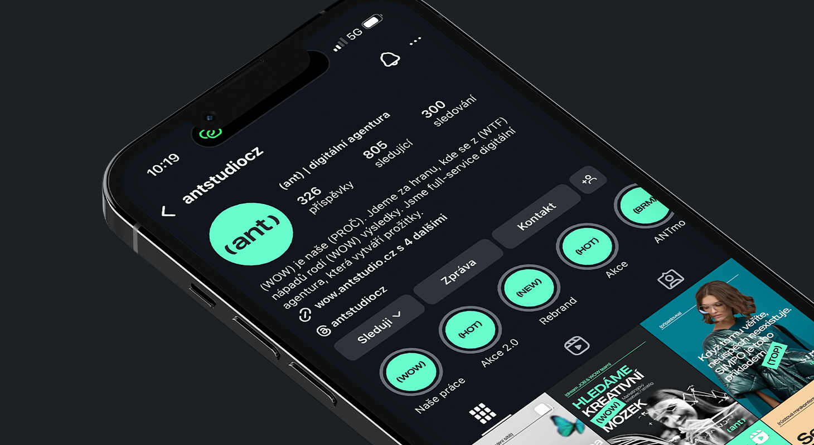

### (ant) – full-service digitální agentura z Plzně

- Jsme (ant) – outsider mezi TOP agenturami. Už víc než 25 let tvoříme WTF nápady a WOW výsledky, které posouvají značky za hranice nudy i očekávání.Na západě Čech jsme doma – a právě tady věříme, že každý projekt si zaslouží jedinečný nápad, silný příběh a strategii, co předčí očekávání. Máme přes 50 expertů a jedno know-how: dělat věci jinak. Míň meetingů, víc flow. Pracujeme chytře, dáváme prostor inspiraci a držíme si volné pátky – protože věříme, že radost z práce je klíčem k výsledkům, které baví. Disrupce pro nás není buzzword, ale přístup. Vymýšlíme odvážné kampaně a strategie, které mají smysl, koule i dopad.(ant) je místo, kde se potkává kreativita, strategie a technologie v jeden funkční celek

#### Instagram bio (150 znaků)

- (WOW) je naše (PROČ). Čeříme vody, lámeme pravidla. Jdeme za hranu, kde se z (WTF) nápadů rodí (WOW) výsledky. Jsme (ant).

#### LinkedIn bio (200–250 znaků)

- (WOW) je naše (PROČ). Čeříme vody, lámeme pravidla. Jdeme za hranu, kde se z (WTF) nápadů rodí (WOW) výsledky. Jsme full-service digitální agentura, která kampaně neopisuje, ale tvoří.

#### Facebook bio (200–250 znaků)

- (WOW) je naše PROČ. Čeříme vody, lámeme pravidla. Jdeme za hranu, kde se z (WTF) nápadů rodí (WOW) výsledky. Jsme full-service digitální agentura, která neopisuje příručky, ale vytváří prožitky.

#### Google snippet (150–160 znaků)

- (WOW) je naše (PROČ). Full-service digitální agentura, která neopisuje příručky, ale vytváří prožitky. Jdeme za hranu, kde se z (WTF) nápadů rodí (WOW) výsledky.

#### Google search (150–160 znaků)

- (WOW) je naše (PROČ). Tvoříme prožitky, čeříme vody, jdeme za hranu. Full-service digitální agentura s (WTF) nápady a (WOW) výsledky. Prostě (ant).

#### Komunikační manuál

Kompletní průvodce verbální identitou (ant)studia. Najdete zde: definici našeho archetypu cílových skupin a praktické ukázky jak tvořit texty, které mají koule a doručují (WOW) výsledky Protože na tom, jak věci říkáme, záleží stejně jako na tom, co děláme.

**Legenda:** Každý řádek = popisek souboru z panelu a relativní cesta v ZIPu (nebo vysvětlení, proč soubor v archivu není).

- **Komunikacní manuál (ant):** `assets/others/ant-komunikacni-manual.pdf`

#### Fotografie

---

**Obrázek v sekci** (1/2)

**Obrázek:** 

---

**Obrázek v sekci** (2/2)

**Obrázek:** 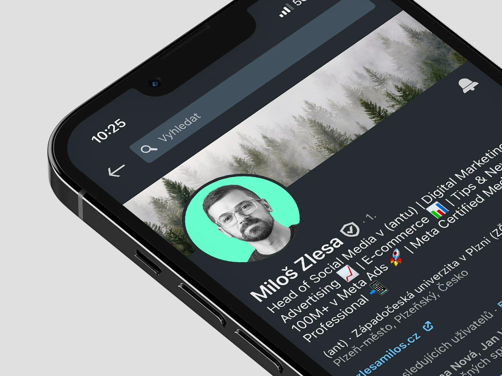

---

**Tlačítka pod obrázkem:**

- **Portrétní foto - ORIGINAL:** https://drive.google.com/drive/folders/1iloCEAPS7w6EGfeAmE4d5U__Eet85qhm?usp=share_link
- **Profilové foto - MINTGREEN:** https://drive.google.com/drive/folders/1vllmrsxIbGUFEo0_86FJtRYF4kjEEXXx?usp=share_link
- **Profily - SOCIAL NETWORK:** https://drive.google.com/drive/folders/1CkZ3cJotHLAYlWlk9zY4ya2wdU61tJD4?usp=sharing


## 12. Design tokeny

*Poznámka: Jde o tokeny použité pro stylizaci online brand manuálu (webové rozhraní manuálu).*

| Token | Hodnota |
| --- | --- |
| Barva záhlaví | #191a1b |
| H1 titulek | #ffffff |
| Nadpisy H2–H6 | #191a1b |
| Text | #697077 |
| Odkazy | #000000 |
| Primární tlačítka | #000000 |
| Zaoblení karet | 10 |

## 13. Přiložené soubory

Tento export obsahuje následující soubory v archivu:

| Soubor | Typ | Popis |
| --- | --- | --- |
| `assets/logos/logo-light-primarni-logo-ant.svg` | logo | Logo pro světlé pozadí — „Primární logo (ant)" |
| `assets/logos/logo-dark-primarni-logo-ant.svg` | logo | Logo pro tmavé pozadí — „Primární logo (ant)" |
| `assets/logos/logo-light-logo-s-claimem.svg` | logo | Logo pro světlé pozadí — „Logo/Označení" |
| `assets/logos/logo-dark-logo-s-claimem.svg` | logo | Logo pro tmavé pozadí — „Logo/Označení" |
| `assets/fonts/inter_font.zip` | download | Stažení písma — „Inter“ — Stáhnout písmo |
| `assets/images/img_obraz.png` | image | Karta rozcestníku — „Tiskoviny“ |
| `assets/images/dohoda_img.png` | image | Karta rozcestníku — „Tiskoviny“ |
| `assets/images/image-2.png` | image | Karta rozcestníku — „Tiskoviny“ |
| `assets/images/label_nahled.webp` | image | Obrázek a text — „Labels“ |
| `assets/images/labels01.webp` | image | Obrázek a text — „Labels“ |
| `assets/images/label_nahled_02.webp` | image | Obrázek a text — „Labels“ |
| `assets/images/labels02.webp` | image | Obrázek a text — „Labels“ |
| `assets/images/02.webp` | image | Obrázek a text — „Autorský podpis“ |
| `assets/images/03.webp` | image | Obrázek a text — „Autorský podpis“ |
| `assets/images/04.webp` | image | Obrázek a text — „Autorský podpis“ |
| `assets/images/meet_01.webp` | image | Obrázek a text — „Google Meet“ |
| `assets/images/meet_07.webp` | image | Obrázek a text — „Google Meet“ |
| `assets/images/meet_03.webp` | image | Obrázek a text — „Google Meet“ |
| `assets/images/meet_02.webp` | image | Obrázek a text — „Google Meet“ |
| `assets/images/meet_06.webp` | image | Obrázek a text — „Google Meet“ |
| `assets/images/meet_05.webp` | image | Obrázek a text — „Google Meet“ |
| `assets/images/meet_04.webp` | image | Obrázek a text — „Google Meet“ |
| `assets/images/frame-1.webp` | image | Obrázek a text — „AI Notetaker“ |
| `assets/others/bot_ant_profil.png` | download | Profil tl;dv - AI Notetaker |
| `assets/images/eml_dlazdice.webp` | image | Obrázek a text — „E-mailový podpis“ |
| `assets/images/stationery_mockup_1.webp` | image | Obrázek a text — „Sekce: Obrázek (multifunkční)“ |
| `assets/images/stationery_mockup_1.webp` | download | Stáhnout náhled |
| `assets/images/stationery_mockup_2.webp` | image | Obrázek a text — „Sekce: Obrázek (jednoduchý)“ |
| `assets/images/stationery_mockup_3.webp` | image | Každou fotografii můžete okomentovat pomocí tohoto popisku — použití: zakázáno (přeškrtnutí) |
| `assets/images/stationery_mockup_4.webp` | image | Každou fotografii můžete okomentovat pomocí tohoto popisku — použití: povoleno (ikona check) |
| `assets/images/stationery_mockup_5.webp` | image | Fotografie může být také bez pravidel (přeškrtnutí nebo s ikonou „check“). — použití: bez pravidel |
| `assets/images/obsahova-stranka-s-prehledem-vsech-sekci/stationery_mockup_1.webp` | image | Galerie (logo na obrázku) — „Sekce: Galerie obrázků“ — použití: bez pravidel |
| `assets/images/stationery_mockup_1.webp` | image | Karusel — „Sekce: Karusel (slideshow)“ |
| `assets/images/stationery_mockup_2.webp` | image | Karusel — „Sekce: Karusel (slideshow)“ |
| `assets/images/obsahova-stranka-s-prehledem-vsech-sekci/stationery_mockup_3.webp` | image | Karusel — „Sekce: Karusel (slideshow)“ |
| `assets/images/obsahova-stranka-s-prehledem-vsech-sekci/stationery_mockup_4.webp` | image | Karusel — „Sekce: Karusel (slideshow)“ |
| `assets/images/obsahova-stranka-s-prehledem-vsech-sekci/stationery_mockup_5.webp` | image | Karusel — „Sekce: Karusel (slideshow)“ |
| `assets/others/stationery_mockup_5.jpg` | download | Další libovolné tlačítko |
| `assets/others/inter-regular.ttf` | download | Regular |
| `assets/others/lexend-medium.ttf` | download | Medium |
| `assets/others/lexend-bold.ttf` | download | Bold |
| `assets/images/02.png` | image | Obrázek v textu (blok) — modul „Brand Messaging“ |
| `assets/others/ant-komunikacni-manual.pdf` | download | Komunikacní manuál (ant) |
| `assets/images/foto01.webp` | image | Obrázek a text — „Fotografie“ |
| `assets/images/foto02.webp` | image | Obrázek a text — „Fotografie“ |
